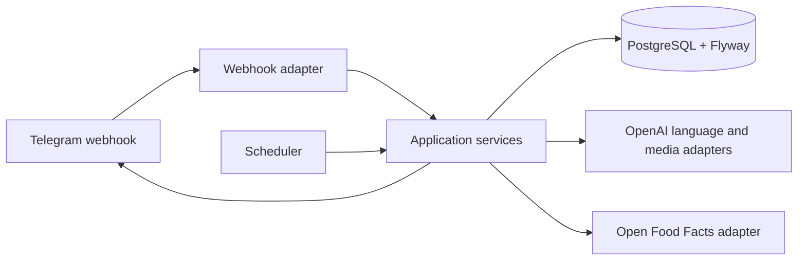

# Architecture

The service is a Spring Boot modular monolith: simple enough for a homelab, with boundaries that allow integrations to change.

## Processing path

1. Verify Telegram webhook secret, parse the update, and atomically claim its `update_id`.
2. Reject non-allowlisted users without exposing private state.
3. Download media only for processing; delete it immediately after transcription/extraction.
4. Convert natural language or media extraction into a typed command.
5. Validate user ownership, dates, quantities, calories, settings, and command semantics.
6. Commit the resulting domain change in one transaction, then send a concise reply/update the pinned daily status.

## Reliability and privacy

Idempotency and report-delivery tables make webhook retries and scheduler restarts safe. Outbound Telegram calls occur after durable state changes and must be retryable. Logs must omit message bodies, credentials, and personal nutrition data unless explicitly enabled for local development.

See ADRs in `docs/adr/` for binding decisions.
