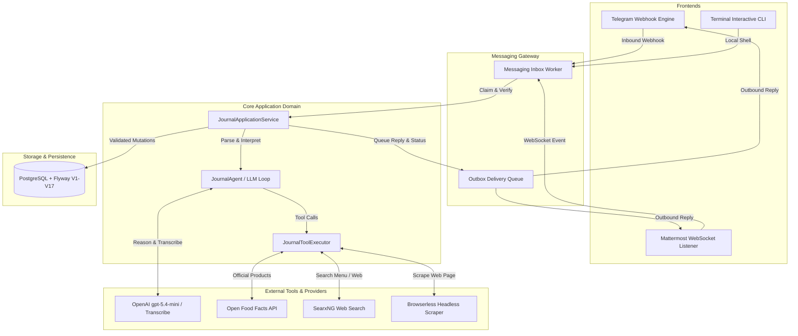

# Architecture

**Food Journal Messaging Bot** is designed as a modular, resilient, privacy-first Spring Boot monolith. It decouples messaging frontends from core application domain logic, ensuring that AI reasoning remains strictly bounded by application-enforced validation rules and database constraints.

---

## Technical Design & Boundaries

### 1. Multi-Frontend Ingestion
- **Telegram Frontend**: Receives HTTPS webhooks, verifies `X-Telegram-Bot-Api-Secret-Token`, checks numeric user ID against `ALLOWED_TELEGRAM_USER_IDS`, and records idempotency in `processed_updates`.
- **Mattermost Frontend**: Connects over WebSocket to self-hosted Mattermost instances (typically exposed privately over Tailscale Serve). Manages direct message sessions and account linking (`/link <code>`).
- **Terminal CLI**: Standalone interactive local development profile that executes real domain flows without messaging platform dependencies.

### 2. The AI Boundary (Reasoning vs. Execution)
- OpenAI models (`gpt-5.4-mini` for intent/tool-calling, `gpt-4o-mini-transcribe` for voice) are **strictly interpretation engines**.
- AI providers **cannot directly mutate the database**. The model calls typed tools exposed by `JournalToolExecutor`.
- The application service (`JournalApplicationService`) validates inputs (ownership, bounds, dates, macro math) before committing any changes.

### 3. Nutrition Resolution & Tool Ecosystem
- **Official Database Lookup**: `CachedNutritionResolver` queries Open Food Facts API for exact barcode or branded food items.
- **Web Search Tool (`search_web`)**: Queries a self-hosted SearxNG instance for restaurant menu items and nutrition information when not found in Open Food Facts.
- **Web Page Scraping (`fetch_web_page`)**: Uses Browserless to extract plain text from nutrition pages or restaurant menus.
- **SSRF Protection**: `BrowserlessClient` validates target URLs and blocks access to localhost, internal subnets, loopback IP ranges, and cloud metadata endpoints.

### 4. Database Integrity & 10-Minute Reversible Undo
- Every mutation (add food, edit calories, delete entry) creates a `JournalChangeSet` containing before/after snapshots (`JournalMutation`).
- Users can undo any action executed within the past 10 minutes by sending `/undo` or saying "undo that".
- Strict user-level authorization: all repository queries enforce `WHERE user_id = :userId`.

### 5. Media Handling & Privacy
- Voice notes, images, and document uploads are processed transiently in memory/tmpfs.
- Media files are deleted immediately after transcription or vision extraction completes. Raw media is **never** saved to disk or PostgreSQL.

### 6. Idempotency & Outbox Pattern
- Outbound responses and pinned daily status updates are committed to database outbox tables (`messaging_outbound_messages`, `messaging_daily_status`).
- A background worker (`MessagingInboxWorker`) processes outbox items, ensuring reliable message delivery across network retries and application restarts.

