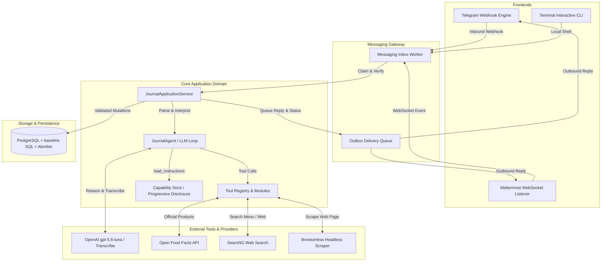

# Architecture

**Food Journal Messaging Bot** is designed as a modular, resilient, privacy-first Python service. It decouples messaging frontends from core application domain logic, ensuring that AI reasoning remains strictly bounded by application-enforced validation rules and database constraints.

---

## Technical Design & Boundaries

### 1. Multi-Frontend Ingestion
- **Telegram Frontend**: Receives HTTPS webhooks, verifies `X-Telegram-Bot-Api-Secret-Token`, checks numeric user ID against persistent access grants, and records idempotency in `messaging_inbox`.
- **Mattermost Frontend**: Connects over WebSocket to self-hosted Mattermost instances (typically exposed privately over Tailscale Serve). Manages direct message sessions and account linking (`link <code>`).
- **Terminal CLI**: Standalone interactive local development profile that executes real domain flows without messaging platform dependencies.

### 2. The AI Boundary (Reasoning vs. Execution)
- OpenAI models (`gpt-5.6-luna` for intent/tool-calling, `gpt-4o-mini-transcribe` for voice) are **strictly interpretation engines**.
- AI providers **cannot directly mutate the database**. The model calls typed tools exposed by the tool registry (`app/tools/`).
- The Python application service validates inputs (ownership, bounds, dates, macro math) before committing any changes.
- **Progressive disclosure (v2.0)**: The core system prompt is small (~15 lines). Capability-specific rules live in markdown docs (`app/agent/capabilities/`) loaded on demand via the `load_instructions(topic)` tool. The model writes full replies from structured tool results — no deterministic reply templates. See [ADR 0007](adr/0007-progressive-disclosure-agent.md).

### 3. Nutrition Resolution & Tool Ecosystem
- **Official Database Lookup**: `nutrition_resolver` queries Open Food Facts API for exact barcode or branded food items.
- **Web Search Tool (`search_web`)**: Queries a self-hosted SearxNG instance for restaurant menu items and nutrition information when not found in Open Food Facts.
- **Web Page Scraping (`fetch_web_page`)**: Uses Browserless to extract plain text from nutrition pages or restaurant menus.
- **SSRF Protection**: URL validation rejects credentials, non-web ports, localhost, internal/non-global DNS results, loopback IP ranges, and cloud metadata endpoints; redirect probes pin each request to the public address that was validated, and every redirect hop is revalidated without blocking the event loop. Browserless is disabled unless `BROWSERLESS_EGRESS_RESTRICTED=true` and an operator-controlled filtering `BROWSERLESS_EGRESS_PROXY_URL` are configured. The final URL is revalidated immediately before dispatch, JavaScript navigation is disabled, and Browserless receives an exact-domain allow-list plus the filtering proxy. The proxy must enforce denial of private, loopback, link-local, and metadata networks; the application fails closed when this boundary is not configured.
- **Weekly Summary (`get_weekly_summary`)**: Aggregates seven days of entries around a reference date, returning per-day totals and weekly-level information. Future reference dates are rejected.
- **Food History Search (`search_food_history`)**: Searches historical entries by food text, returning match count, first/last occurrence, average calories, and recent entries. User-scoped.
- **Custom Food Aliases (`save_alias`/`resolve_alias`)**: User-scoped shorthand mappings (e.g. "cafea" → "coffee with milk, 30ml") with optional nutrition shortcuts. Case-insensitive resolution. Aliases are isolated per user; no cross-user visibility.

### 4. Database Integrity & 10-Minute Reversible Undo
- Every mutation (add food, edit calories, delete entry) creates a `JournalChangeSet` containing before/after snapshots (`JournalMutation`); snapshots for nutrition-backed items retain immutable `NutritionEvidence` so Undo does not discard provenance.
- Users can undo any action executed within the past 10 minutes by sending `/undo` or saying "undo that".
- Inbox processing persists the inbound receipt timestamp, keeps the message claim in the outer transaction, and runs business work inside a savepoint. Date interpretation uses that receipt time even when workers process a backlog. Expected per-action validation failures are reported independently; unexpected failures roll back journal, tool, and outbox changes before the inbox retry is recorded, including a fresh recovery transaction for database-aborting or final-commit failures. Pinned daily-status bookkeeping, conversation-memory, and provider-neutral status bookkeeping use independent nested savepoints so optional bookkeeping failures do not replay a committed journal mutation.
- If the model provider fails after a successful journal mutation, the application renders a minimal receipt from the server-owned structured result so the user is not told to retry an already-committed action.
- Tool arguments are bounded and validated at runtime; positive quantities must be representable at the journal's two-decimal database precision, and derived nutrition totals must fit the journal limits before quotes or entries are persisted, with matching bounds in the model schemas.
- Journal mutations and Undo serialize on the verified user row; Undo locks owned entries and verifies the current entry/item snapshot still matches the latest change set before restoring it.
- Malformed persisted inbox payloads are strictly type-validated and terminal failures, while transient business failures retain bounded retry behavior.
- Strict user-level authorization: all repository queries enforce `WHERE user_id = :userId`.

### 5. Media Handling & Privacy
- Voice notes, images, and document uploads are processed transiently in memory/tmpfs.
- Media files are deleted immediately after transcription or vision extraction completes. Raw media is **never** saved to disk or PostgreSQL.

### 6. Idempotency & Outbox Pattern
- Outbound responses and pinned daily status updates are committed to database outbox tables (`messaging_outbox`, `messaging_daily_status`).
- A background worker (`MessagingInboxWorker`) processes outbox items, ensuring reliable message delivery across network retries and application restarts.

